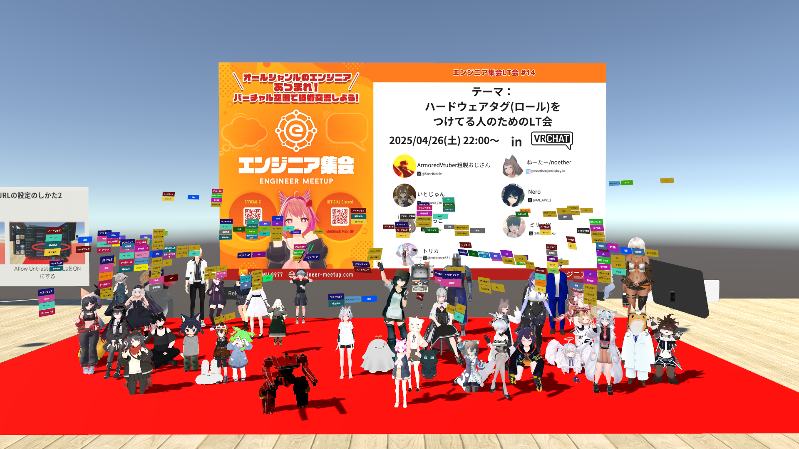

エンジニア集会では、以下のようなイベントを開催しています

### エンジニア集会

開催日時：毎週金曜日22:00~  
開催場所：VRChat  
スケジュール：
- 22:00 開場
- 22:00 ~ 23:00 自由に雑談
- 23:00 集合写真を撮影
- 23:00 ~ 23:30 進捗共有会
- 23:30 ~ 深夜 自由な交流・雑談タイム

エンジニア集会の主なイベントは、毎週金曜日に開催している「エンジニア集会」です。  
集合写真を撮影した後、進捗共有会を実施しています。進捗共有会が終わった後は、自由な交流・雑談タイムが深夜まで続きます。

#### イベントの様子

*VRChat会場の集合写真*

*VRChat会場の様子*

### エンジニア集会LT会

開催日時：不定期
開催場所：VRChat

エンジニア集会では、不定期にLT会を開催しています。主な会場はVRChatです。

#### イベントの様子

<iframe style="width: 657px; height: 369px;" src="https://www.youtube.com/embed/prbLM8lg0Rg?si=pO3EDbAleS3Es5GA" title="YouTube video player" frameborder="0" allow="accelerometer; autoplay; clipboard-write; encrypted-media; gyroscope; picture-in-picture; web-share" allowfullscreen></iframe>

*過去の開催動画はこちら: エンジニア集会 LT会#4 〇〇のはじめかた*

*LT会の集合写真*

### もくもく会

開催日時：毎週日曜日10:00~11:00
開催場所：エンジニア集会Discordサーバー

毎週日曜日にエンジニア集会のDiscordサーバーでもくもく会を開催しています。

