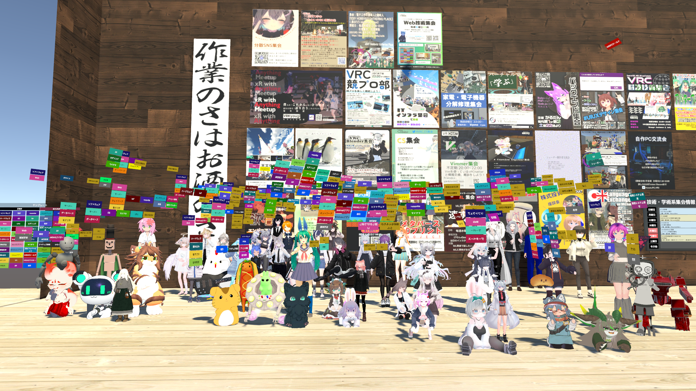

エンジニア集会とは、様々な技術者がVRSNSを中心に技術者交流を行うことができるコミュニティです

  <iframe loading="lazy" style="position: absolute; width: 100%; height: 100%; top: 0; left: 0; border: none; padding: 0;margin: 0;"
    src="https://www.canva.com/design/DAGQqSmspPE/4gcefrJTSBsZ5x7OhOf2jg/view?embed" allowfullscreen="allowfullscreen" allow="fullscreen">
  </iframe>

慕狼ゆにさんによる<a href="https:&#x2F;&#x2F;www.canva.com&#x2F;design&#x2F;DAGQqSmspPE&#x2F;4gcefrJTSBsZ5x7OhOf2jg&#x2F;view?utm_content=DAGQqSmspPE&amp;utm_campaign=designshare&amp;utm_medium=embeds&amp;utm_source=link" target="_blank" rel="noopener">エンジニア集会の紹介（外部紹介用）</a>

## どんなジャンルのエンジニアが参加できますか？

オールジャンルのエンジニアが参加可能です。  
ソフトウェア、ハードウェアのエンジニアや、工学系のエンジニア、上流工程や要件定義をしているエンジニアなどなど、ジャンルは問いません。
エンジニア集会は、**なにかしらの分野でエンジニアリングをしている人**なら誰でも参加できます。

また、エンジニアに限らず、エンジニアやエンジニアリングに興味がある人も参加歓迎です。

## エンジニア集会に参加するには？

エンジニア集会は、毎週金曜日に「エンジニア集会」というイベントをやっています。こちらがメインのイベントなので、エンジニア集会に興味がある方は、「エンジニア集会」への参加をおすすめします。  
金曜日に[VRChat](https://www.moguravr.com/vrchat-super-basic-knowledge/)というVRプラットフォームで開催しています。  
イベント参加をする際には、アカウントを作成して参加してください。

- VRChat
  - [VRChatのはじめかた](https://vr-lifemagazine.com/vrcguide202305/)
  - [VRChatダウンロードページ](https://store.steampowered.com/app/438100/VRChat/)
    - ※Desktop/VRモードで遊ぶには、Steamからダウンロードする必要があります。その際にはSteamアカウントも必要になります。

### VRChat開催の参加方法

VRChat開催では、Group+という種類のインスタンスで開催します。  
※Group+とは、Group参加者やインスタンス入室している人のフレンドが参加できるインスタンスです。  
事前に、[エンジニア集会のGroup](https://vrchat.com/home/group/grp_5a802e77-a436-491a-9edb-39fca4ff7805)に参加しておくと、インスタンスを見つけやすいです。
